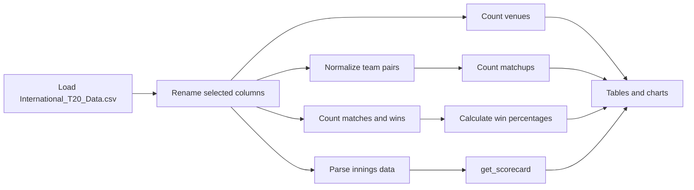

<div align="center">

# 🏏 International Cricket Council Data Analysis

**A notebook-based exploration of international T20 cricket data and core Python data-science techniques.**

<p>
  <a href="https://www.python.org/"></a>
  <a href="https://pandas.pydata.org/"></a>
  <a href="https://numpy.org/"></a>
  <a href="https://matplotlib.org/"></a>
  <a href="https://github.com/Jeania-2k5/DS_ICC"></a>
</p>

</div>

## 📌 Overview

This repository contains two Jupyter notebooks from a data-science learning project:

- **International Cricket Council (ICC) analysis** explores a dataset of 1,417 international T20 matches. It cleans selected column names, compares venues and team pairings, calculates team win percentages, visualizes those summaries, and builds a match scorecard function.
- **Libraries** is a hands-on reference notebook covering NumPy arrays, Pandas data manipulation, and Matplotlib/Seaborn examples such as filtering, reshaping, missing values, dates, correlation, and plots.

The notebooks are useful as an approachable starting point for exploratory data analysis: each workflow is visible, editable, and runnable cell by cell.

## 🗂️ Contents

| Notebook | What it covers | Open |
| --- | --- | --- |
| `International_Cricket_Council_(ICC).ipynb` | ICC T20 match exploration, summary tables, charts, and scorecards | [View notebook](International_Cricket_Council_(ICC).ipynb) · [Open in Colab](https://colab.research.google.com/github/Jeania-2k5/DS_ICC/blob/main/International_Cricket_Council_%28ICC%29.ipynb) |
| `Libraries.ipynb` | NumPy, Pandas, Matplotlib, and Seaborn practice examples | [View notebook](Libraries.ipynb) · [Open in Colab](https://colab.research.google.com/github/Jeania-2k5/DS_ICC/blob/main/Libraries.ipynb) |

> **Data availability:** the notebooks reference `International_T20_Data.csv`, `imdb_data.csv`, and a `company_sales_data` path, but those data assets are not included in this repository. Add the required files in the expected working directory before running the affected cells.

## 🔍 ICC Analysis Workflow

The main notebook follows this path:



### 🧮 Technical details

The ICC notebook uses:

- **Pandas** for CSV loading, column renaming, string splitting, frequency tables, sorting, and DataFrames.
- **NumPy** for numerical support.
- **Matplotlib** and **Seaborn** for venue, rivalry, team, scorecard, pie, and correlation visualizations.
- Python's **`ast.literal_eval`** to turn the serialized `innings` column into Python data before scorecard generation.

The selected column names are made easier to work with, for example `info.venue` becomes `venue`, `info.teams` becomes `teams`, and `info.outcome.winner` becomes `winner`.

Team pairings are made order-independent by sorting the two team names before counting them. The notebook defines win percentage as:

$$
\text{Win Percentage} = \frac{\text{Matches Won}}{\text{Matches Played}} \times 100
$$

`get_scorecard(innings)` reads the first two innings, totals batter runs and bowler runs conceded from deliveries, and returns two DataFrames. Each combines the top four batters with four bowlers selected by lowest runs conceded for the opposing side.

### 📊 Saved example observations

These values are present in the executed ICC notebook output:

| Analysis | Output shown in the notebook |
| --- | --- |
| Top venue | Dubai International Cricket Stadium — 62 matches |
| Next venues | Sheikh Zayed Stadium — 41; Shere Bangla National Stadium — 39 |
| Most frequent matchup | Australia vs England — 45 matches |
| Other frequent matchups | Australia vs Pakistan — 33; England vs West Indies — 33 |
| Highest displayed win percentage | Belgium — 100.00% |

The results depend on the referenced dataset and the notebook's current transformations; they are not produced by a packaged command-line application.

## 🖼️ Output Gallery

No standalone image files are currently stored in the repository. The ICC notebook does contain rendered chart outputs, so the placeholders below indicate useful captures to export if a visual gallery is added later.

<table>
  <tr>
    <td align="center"><strong>Venue comparison</strong><br><br><em>Placeholder: capture the “Top 3 Venues Hosting T20 Matches” chart from the ICC notebook.</em></td>
    <td align="center"><strong>Team performance</strong><br><br><em>Placeholder: capture the “Top 5 Teams by Win Percentage” chart or donut chart.</em></td>
  </tr>
  <tr>
    <td align="center"><strong>Matchup frequency</strong><br><br><em>Placeholder: capture the “Top 5 Most Played T20 Rivalries” chart.</em></td>
    <td align="center"><strong>Scorecard output</strong><br><br><em>Placeholder: capture the two scorecard DataFrames and their scorecard chart.</em></td>
  </tr>
</table>

## 🚀 Installation and Run

### 1. Clone the repository

```bash
git clone https://github.com/Jeania-2k5/DS_ICC.git
cd DS_ICC
```

### 2. Create an environment and install notebook dependencies

```bash
python -m venv .venv
source .venv/bin/activate
python -m pip install --upgrade pip
python -m pip install jupyter pandas numpy matplotlib seaborn
```

On Windows PowerShell, activate the environment with:

```powershell
.venv\Scripts\Activate.ps1
```

### 3. Add the data files required by the notebooks

Place `International_T20_Data.csv` beside the ICC notebook before running its data-analysis cells. The `Libraries` notebook expects `imdb_data.csv` and later refers to `company_sales_data`; those files are not part of this repository.

### 4. Launch Jupyter

```bash
jupyter lab
```

Open either notebook and run the cells in order. The ICC notebook has saved execution outputs, but a fresh run requires the missing CSV input. The `Libraries` notebook contains Colab-oriented cells such as `%matplotlib inline` and `%lsmagic`, so run it in a Jupyter-compatible environment.

## 📁 Repository Structure

```text
DS_ICC/
├── International_Cricket_Council_(ICC).ipynb  # ICC T20 exploration and scorecard analysis
├── Libraries.ipynb                             # NumPy, Pandas, Matplotlib, and Seaborn practice
└── README.md                                   # Project documentation
```

## ⚠️ Limitations

- The data files referenced by both notebooks are not committed here, so a clean clone cannot reproduce every cell immediately.
- The notebooks are exploratory assignments rather than a tested Python package or production pipeline.
- The scorecard function totals batter runs and runs conceded from delivery records; it does not implement a complete cricket scorecard model with wickets, extras, overs, or bowling figures.
- No license is declared in the repository yet. See the license section below before reusing the work.

## 🤝 Contributing

Small improvements are welcome: clearer notebook explanations, reproducible data setup, exported chart images, and fixes for cells that depend on unavailable files are all useful contributions. Please keep changes focused and explain how notebook results were verified.

## 📄 License

<!-- TODO: Add the license chosen by the repository owner and replace this notice. -->
No license is currently specified in this repository. Until one is added, assume that reuse, redistribution, and modification require the author's permission.

## ⭐ Support the Project

If this notebook collection helps you learn data analysis, [star the repository](https://github.com/Jeania-2k5/DS_ICC) and share what you explored.
